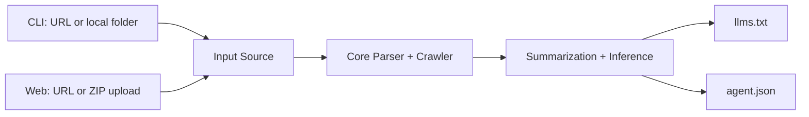

# llms-txt-generator

Turn docs into agent-ready discovery files.

`llms-txt-generator` crawls a URL or scans local docs and outputs:

- `llms.txt` for fast agent-readable summaries
- `agent.json` for structured metadata (docs, capabilities, endpoints, auth hints)

## Why this exists

Traditional docs are written for humans. Agents need predictable structure.
This project helps you ship an agent-friendly layer without hand-writing metadata.

## What you get

| Input | Output | Use case |
|---|---|---|
| Website docs URL | `llms.txt` + `agent.json` | Publish agent-discoverable metadata for public docs |
| Local docs folder | `llms.txt` + `agent.json` | Generate artifacts from markdown/html docs in a repo |
| Zipped docs upload (web) | `llms.txt` + `agent.json` zip download | Non-CLI users and quick sharing |

## 60-second quick start

### 1. Install

```bash
cd llms-txt-generator
pnpm install
```

### 2. Generate from a URL

```bash
pnpm --filter llms-txt-cli build
pnpm --filter llms-txt-cli exec node dist/index.js https://example.com --out ./output
```

### 3. Open results

```bash
cat ./output/llms.txt
cat ./output/agent.json
```

## Visual architecture



## Example output

### `llms.txt` (excerpt)

```txt
# acme-docs

> Generated from crawled website pages. Key topics: api, authentication, models.

## Pages
- Intro (/docs/intro)
  Learn how to authenticate and call the models endpoint.
```

### `agent.json` (excerpt)

```json
{
  "name": "acme-docs",
  "sourceType": "url",
  "docs": [
    {
      "source": "https://docs.example.com/intro",
      "title": "Intro",
      "summary": "Learn how to authenticate and call the models endpoint."
    }
  ],
  "endpoints": [
    { "method": "GET", "path": "/v1/models", "auth": "api_key" }
  ]
}
```

## CLI usage

### URL mode

```bash
pnpm --filter llms-txt-cli exec node dist/index.js https://docs.example.com --out ./output --max-pages 25
```

### Local mode

```bash
pnpm --filter llms-txt-cli exec node dist/index.js ./docs --local --out ./output
```

### Options

| Flag | Description | Default |
|---|---|---|
| `--local` | Treat target as local directory | `false` |
| `--out <dir>` | Output directory | `./output` |
| `--exclude <glob...>` | Exclude file/path patterns | none |
| `--max-pages <n>` | Max pages to crawl in URL mode | `20` |
| `--name <name>` | Override generated project name | inferred |

## Web app

Run locally:

```bash
pnpm --filter llms-txt-web dev
```

Open [http://localhost:3000](http://localhost:3000) and choose:

- `Website URL`
- `Zip Upload` (`.md`, `.mdx`, `.txt`, `.html`, `.htm`)

You will receive `llms-txt-output.zip` with both files.

## Repository structure

```txt
.
├── apps
│   ├── cli
│   └── web
├── packages
│   ├── core
│   └── schemas
└── README.md
```

## License

MIT. See `LICENSE`.
